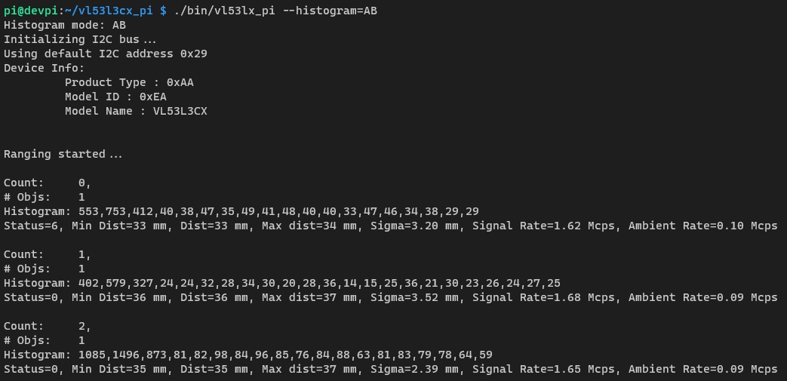
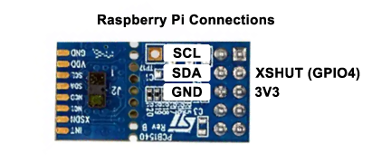

# VL53L3CX Raspberry Pi C Library

## Screenshot

## Wiring

## Build from source
You can build the application from source using the following steps:
        
1. Install ZeroMQ dependency

        sudo apt install libczmq-dev
2. Clone the repo and build

        git clone https://github.com/74ls04/vl53lx-pi.git
        cd vl53lx-pi
        make vl53lx-pi

3. Then you can run it using:

        ./bin/vl53lx-pi

To publish the data over the network on default port `5556` you must use the compact flag `--compact` or `-c`. For example to publish histogram B data only, use the command
        
        ./bin/vl53lx_pi --compact --histogram=B

## Configure and start
To start the application, you can use the `vl53lx_pi` executable. There are several things you can configure:
  

        Usage: ./bin/vl53lx_pi [OPTION]...
        Options:
        -g, --histogram=NAME                  Show histogram data. A, B, or AB.
        -c, --compact                         Enable compact mode.
        -q, --quiet                           Disable debug messages.
        -d, --distance-mode=MODE              Set distance mode. SHORT, MEDIUM, or LONG.
        -p, --port=NUMBER                     Set the port number for publishing data. Default 5556.
        -m, --poll-period=MILLISECONDS        Set device polling period in (ms). (Default=33).
        -t, --timing-budget=MILLISECONDS      Set VL53L3CX timing budget (8ms to 500ms). (Default=33).
        -x, --xshut-pin=NUMBER                Set GPIO pin for XSHUT (Default=4).
        -a, --address=ADDRESS                 Set VL53L3CX I2C address.
        -h, --help                            Print this help message.

## Install or update [NOT COMPLETE]
To install, download the latest release from the [releases page](https://github.com/74ls04/vl53lx-pi/releases) 
        
        wget http://RELEASE_NAME_URL.tar.gz
Extract the application to the install directory:

        rm -rf /usr/local/vl53lx-pi && tar -C /usr/local -xzf RELEASE_NAME.tar.gz

Then add the application to the PATH environment variable:

        echo 'export PATH=$PATH:/usr/local/vl53lx-pi'  >> $HOME/.profile

You can make the changes immediately available by running:

        source $HOME/.profile

Verify installation by running:

        $ vl53lx-pi --help
        
## Uninstall
To uninstall, run the command using sudo:
        
        rm -rf /usr/local/vl53lx-pi

